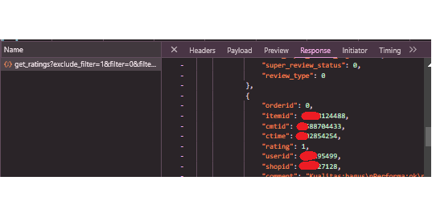
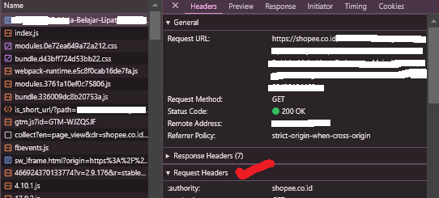

# Shopee Comments Scrape

A python script to fetch shopee comments on a product using the shopee link of the product

## Nomenklatur Dataset

| Atribut         | Penjelasan                        |
| --------------- | --------------------------------- |
| nama pengguna   | nama user yang memberikan review  |
| review          | isi text review                   |
| rating          | rating yang diberikan pada produk |
| waktu transaksi | waktu user transaksi              |

## Persyaratan

Sebelum memulai, pastikan Anda telah memenuhi persyaratan berikut:

1. Anda telah menginstal Python 3.x.
2. Anda memiliki akses ke terminal atau antarmuka baris perintah.
3. Anda telah menginstal Git (opsional, untuk cloning repository).

## Installation

- Git Clone -> git clone https://github.com/stevenunsia/ScrapeProdukShopee
- Masuk ke direktori - > cd ScrapeProdukShopee
- Login Shopee
- Inspect element
- pilih tab network, lalu refresh halaman
- Gunakan filter, cari get_rating?, apabila tidak muncul bisa klik tombol penilain produk untuk meng trigger
- Buka file, cek di bagian respond copy userid, dan shopid nya ke scrape.py.


- lalu setting config.json
    - pilih tab network, cek request header, sesuaikan dengan format dibawah
    

  ```
  {"headers": {
       "User-Agent": "...",
       "Accept": "...",
       "Accept-Language": "...",
       "Accept-Encoding": "...",
       "Upgrade-Insecure-Requests": "...",
       "Sec-Fetch-Dest": "..",
       "Sec-Fetch-Mode": "...",
       "Sec-Fetch-Site": "...",
       "Sec-Fetch-User": "...",
       "cookies": "...",
       "Connection": "..."
    }
  }
  ```
    - Done.

- Credit :
- https://github.com/AmmarulJ/Scraper-Shopee-Update
- https://github.com/ZuyLeLe/Shopee-Lazada_Comments_Scrape